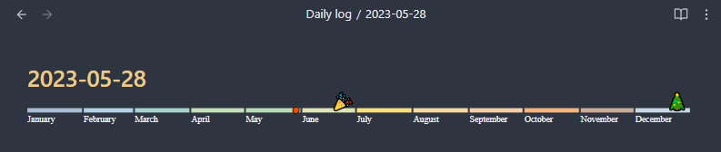

# Obsidian year timeline plugin

[](https://ko-fi.com/P5P2GIRD6)

Add a configurable year timeline to your Obsidian notes.  
Change colors, rename months and place markers for important events on your timeline!



## How to use it in Daily Notes or Templater templates
1. Install the plugin
2. Open the Year Timeline plugin settings page and generate a snippet.  
   Or copy from here
   - Daily Notes
      ```html
      <i data-timeline="{{date:DDD}}"></i>
      ```
   - Templater
      ```html
      <i data-timeline="<% tp.date.now("DDD", 0, tp.file.title) %>"></i>
      ```
3. Place the generated snippet in your markdown template file where you want the timeline to appear.

### Daily Notes integration (experimental)
There is an option in the settings page to enable integration with the Obsidian Daily Notes plugin.  
Enabling this option will allow you to click on the timeline to navigate between the daily notes.  
The timeline plugin will try to use the necessary Daily Notes settings automatically.  
As this is an experimental setting and hasn't been properly tested yet, it is disabled by default.

## How to use it in a vault's home or portal page
1. Install the plugin
2. Open the settings page and generate the DataView JavaScript snippet
3. Place the generated snippet in your markdown file.
